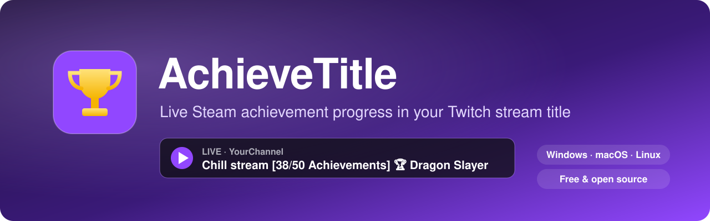
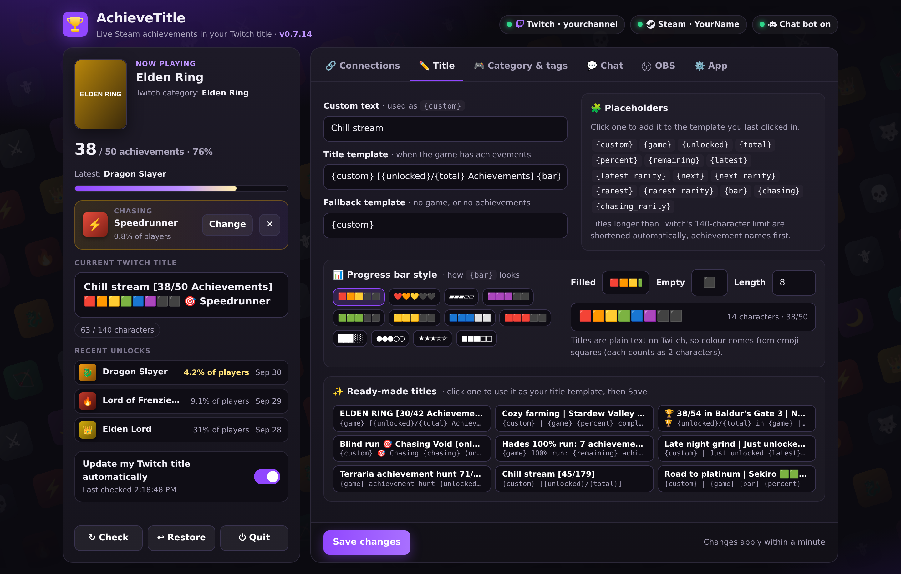
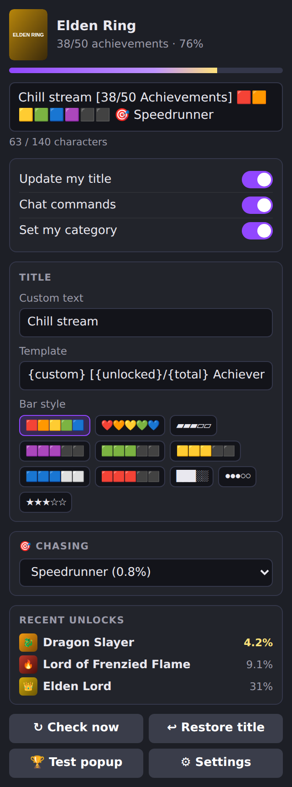
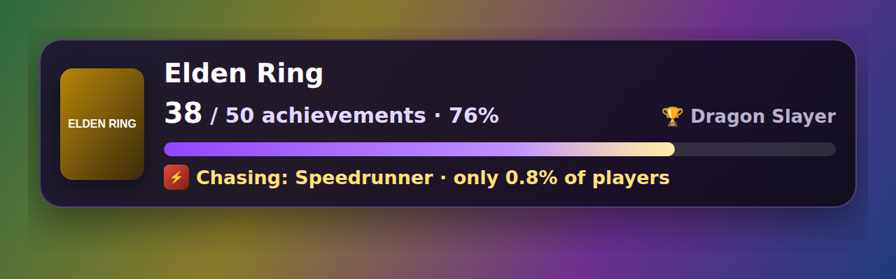
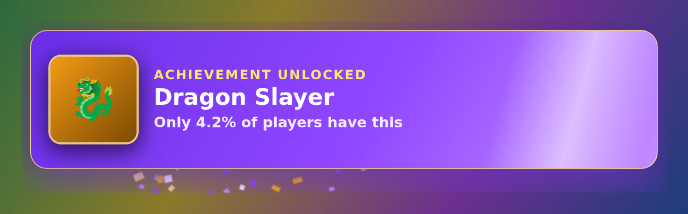
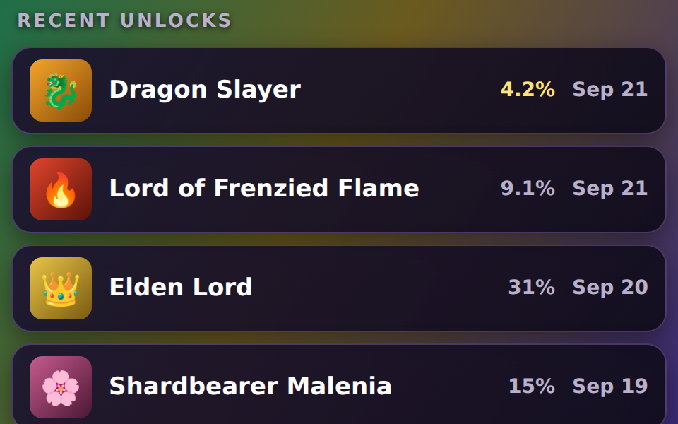

<p align="center">
  
</p>

<p align="center">
  <a href="https://github.com/ImSammyTTV/AchieveTitle/releases/latest"></a>
  <a href="https://github.com/ImSammyTTV/AchieveTitle/releases"></a>
  
  <a href="LICENSE"></a>
</p>

<p align="center">
  <b>AchieveTitle</b> keeps your Twitch title in sync with your Steam achievements while you play,<br>
  so viewers always see how far into the game you are.
</p>

<p align="center">
  <a href="https://github.com/ImSammyTTV/AchieveTitle/releases/latest"><b>⬇️ Download</b></a> ·
  <a href="#-quick-start"><b>🚀 Quick start</b></a> ·
  <a href="#-chat-commands"><b>💬 Chat</b></a> ·
  <a href="#-obs"> <b>OBS</b></a> ·
  <a href="#-mac"> <b>Mac</b></a> ·
  <a href="#-linux"> <b>Linux</b></a> ·
  <a href="#-help"><b>❓ Help</b></a> ·
  <a href="https://github.com/ImSammyTTV/AchieveTitle/issues/new"><b>🐛 Report a bug</b></a>
</p>

---

## ✨ Features

<table>
<tr>
<td width="50%" valign="top">

### 🏆 Live achievement titles
Your title updates as you unlock achievements, for example
`Chill stream [38/50 Achievements] 🏆 Dragon Slayer`. Nothing is sent to Twitch unless something changed.

</td>
<td width="50%" valign="top">

### 🎮 Automatic category
Switches your Twitch category to the Steam game you're playing, **or pick the game yourself** from a
search with box art. Great for non-Steam games.

</td>
</tr>
<tr>
<td valign="top">

### ✏️ Your title, your way
Templates with placeholders for progress, rarity and more, plus a progress bar in the style you like
(🟩🟩⬛⬛ or ▰▰▱▱). Titles are shortened automatically to fit Twitch's 140-character limit.

</td>
<td valign="top">

###  Built for OBS
One-click OBS setup, a control panel dock, and an overlay with **animated unlock celebrations**, sounds
and the real **achievement art**.

</td>
</tr>
<tr>
<td valign="top">

### 🎯 Chasing
Pick the achievement you're going for. It shows on your overlay, in your title and with `!chasing`,
and clears itself when you get it.

</td>
<td valign="top">

### 💬 Chat commands
`!achievements`, `!next`, `!rarest` and more, answered by your own bot account, plus optional
unlock announcements in chat.

</td>
</tr>
<tr>
<td valign="top">

### ⬆️ Updates itself
Sits quietly in your system tray / menu bar, checks for new versions and installs them with one click.
Puts your original title back when you stop.

</td>
<td valign="top">

### 🔒 Private by design
No accounts, no servers, no tracking. Everything runs on your own computer.

</td>
</tr>
</table>

<p align="center">
  
</p>

> [!NOTE]
> **Private by design.** AchieveTitle runs entirely on your own computer. Your Steam key and Twitch login
> never leave it, and the settings page only works on your PC (`http://localhost:7878`).

---

## 🚀 Quick start

1. **Download** the file for your system from the [latest release](https://github.com/ImSammyTTV/AchieveTitle/releases/latest):

   | System | Download |
   |---|---|
   | &nbsp;**Windows** | `AchieveTitle-…-windows-amd64.zip` |
   | &nbsp;**Mac** | [one-line installer](#-mac), Homebrew, or `…-darwin-arm64.zip` / `…-darwin-amd64.zip` |
   | &nbsp;**Linux** | see [Linux](#-linux) below |

2. **Unzip and run AchieveTitle.** The settings page opens in your browser and a 🏆 appears in your tray / menu bar.
3. Click **Connect Twitch**.
4. Click **Sign in with Steam**, then **Get my key**: type `localhost` as the domain, click *Register* and paste the key back in.
   AchieveTitle checks it straight away and shows your Steam name when it works.
5. Set your Steam **profile** and **Game details** to *Public*: Steam → Profile → Edit Profile → Privacy Settings.
6. Switch on **Update my Twitch title automatically** in the status card. Done!

> [!TIP]
> **Windows** may say *"Windows protected your PC"*: click **More info → Run anyway**.
> **Mac:** use the [one-line installer](#-mac) to skip macOS's security prompts entirely.

---

## ✏️ Title templates

Build your title from any text plus these placeholders:

| Placeholder | Shows | Example |
|---|---|---|
| `{custom}` | Your own text | `Chill stream` |
| `{game}` | Game you're playing | `Elden Ring` |
| `{unlocked}` · `{total}` · `{remaining}` | Achievement counts | `38` · `50` · `12` |
| `{percent}` | Completion | `76%` |
| `{latest}` · `{latest_rarity}` | Your latest unlock and how rare it is | `Dragon Slayer` · `4.2%` |
| `{next}` · `{next_rarity}` | Rarest achievement you're still missing | `Speedrunner` · `0.8%` |
| `{rarest}` · `{rarest_rarity}` | Rarest achievement you've unlocked | `Dragon Slayer` · `4.2%` |
| `{chasing}` · `{chasing_rarity}` | The achievement you're [chasing](#-chasing) | `Speedrunner` · `0.8%` |
| `{bar}` | A progress bar, in the style you pick | `🟩🟩🟩🟩🟩🟩⬛⬛` or `▰▰▰▰▰▰▰▱▱▱` |

**Examples**

```text
{custom} [{unlocked}/{total} Achievements] 🏆 {latest}   →  Chill stream [38/50 Achievements] 🏆 Dragon Slayer
{game} 100% run: {percent} done, {remaining} to go         →  Elden Ring 100% run: 76% done, 12 to go
{game} {bar} 🎯 {chasing}                                  →  Elden Ring 🟩🟩🟩🟩🟩🟩⬛⬛ 🎯 Speedrunner
```

A **fallback template** is used when you're not in a Steam game or the game has no achievements.

**Progress bar style:** in the *Title* tab, pick how `{bar}` looks: coloured emoji squares (🟪⬛, 🟩⬛, 🟨⬛, 🟦⬜, 🟥⬛),
text styles (▰▱, █░, ●○, ★☆) or your own characters, 5 to 20 segments long. Twitch titles are plain text, so the colour
comes from the emoji themselves.

---

## 🎯 Chasing

Going for one achievement in particular? Click **Pick** next to *Chasing* in the status card (or use the OBS panel)
and choose from your locked achievements, rarest first. It then shows:

- on your **overlay**: *🎯 Chasing: Speedrunner · only 0.8% of players*
- in your **title** with `{chasing}` and `{chasing_rarity}`
- in **chat** with `!chasing`

It's remembered for each game, and clears itself the moment you unlock it (with the usual celebration).

---

## 💬 Chat commands

Let viewers check your progress in chat. Switch it on in the **Chat** tab (or from the OBS panel).

| Command | Example reply |
|---|---|
| `!achievements` | 🏆 yourchannel has 38/50 achievements in Elden Ring (76%). Latest: Dragon Slayer |
| `!last` | Latest unlocks: Dragon Slayer (4.2%), Lord of Frenzied Flame (9%), Elden Lord (31%) |
| `!next` | Next hunt: Speedrunner (only 0.8% of players have it) |
| `!rarest` | Rarest unlock so far: Dragon Slayer (only 4.2% of players have it) |
| `!progress` | Elden Ring: ▰▰▰▰▰▰▰▱▱▱ 76% (38/50) |
| `!chasing` | 🎯 Currently chasing Speedrunner (only 0.8% of players have it). Win a run in under 10 minutes |

- Turn each command **on or off**, **rename** it (e.g. `!ach`) and **write your own reply** with placeholders.
- Optional **unlock announcements**: *"🎉 yourchannel just unlocked Dragon Slayer (only 4.2% of players have it)!"*
- A **cooldown** stops spam; you and your mods skip it.

> [!TIP]
> Replies come from a **bot account** you connect (make a free Twitch account like `yournamebot`, then click
> **Connect bot account** and choose *Not you?* on Twitch to log in as it). Type `/mod yournamebot` in your chat
> so it's never slowed down. Prefer no bot? Choose **My own channel account** instead.

---

##  OBS

### One-click setup
Close OBS, open AchieveTitle's **OBS** tab and click **Set up OBS for me**. It adds the **AchieveTitle script**
(starts AchieveTitle with OBS and only updates your title while you're live) and the **control panel** under
*View → Docks*. Your OBS settings are backed up first, as `.achievetitle-backup` files next to the originals.

### Control panel
Change the things you touch mid-stream without leaving OBS: switch title updates, chat commands and category on
or off, edit your custom text and template, pick a bar style, choose what you're chasing, see recent unlocks,
and send a test popup. Changes apply instantly.

<p align="center">
  
</p>

### Overlay
<p align="center">
  <br>
  
</p>

Shows your game, progress and what you're chasing, and celebrates every unlock with the **achievement's art**,
an animation (**Confetti**, **Glow** or **Simple**) and a sound (**Chime**, **Fanfare**, **your own file** or none).
The **OBS** tab has a live preview, a **Test popup** button and these steps:

1. In OBS, **Sources → + → Browser**, name it *AchieveTitle overlay*.
2. URL `http://localhost:7878/overlay`, **Width 600**, **Height 160**.
3. Tick **Control audio via OBS** so the unlock sound shows up in your audio mixer, then click **OK**.

**Recent unlocks list:** add another Browser source with URL `http://localhost:7878/overlay/recent`,
**Width 480**, **Height 420**. It shows your latest unlocks with their art and rarity, and new ones slide in with a gold flash.
Add `?count=3` for fewer rows (up to 6), `?heading=0` to hide the heading or `?hideidle=1` to hide it outside a Steam game
(join several with `&`).

<p align="center">
  
</p>

<details>
<summary>Setting up the script and control panel by hand instead</summary>

- **Control panel:** *View → Docks → Custom Browser Docks*, name `AchieveTitle`, URL `http://localhost:7878/dock`.
- **Script:** *Tools → Scripts → +* and choose `obs/achievetitle.lua` from the download, then pick the AchieveTitle app in its settings.
</details>

> [!WARNING]
> OBS's own *Stream Information* panel also sets your title. If you press *Update* there, it overwrites
> AchieveTitle's title until the next change.

---

##  Mac

Open **Terminal** (press ⌘ Space, type *Terminal*, press Enter), paste this and press Enter:

```sh
curl -fsSL https://raw.githubusercontent.com/ImSammyTTV/AchieveTitle/main/install-mac.sh | sh
```

It picks the right version for your Mac, checks the download against the release's checksum, installs
**AchieveTitle.app** into Applications and opens it. There are no *"can't be opened"* warnings, because Terminal downloads
aren't quarantined the way browser downloads are.

**Use Homebrew?** Install it with:

```sh
brew tap imsammyttv/achievetitle https://github.com/ImSammyTTV/AchieveTitle
brew install --cask achievetitle
```

<details>
<summary>Installing from the zip instead</summary>

AchieveTitle isn't signed by Apple yet, so macOS blocks it the first time:

1. Unzip, move **AchieveTitle.app** to Applications and double-click it. macOS says it can't be opened: click **Done**.
2. Open **System Settings → Privacy & Security**, scroll down and click **Open Anyway** next to AchieveTitle.
3. Confirm with your password. From then on it opens normally.
</details>

Uninstall: `curl -fsSL …/install-mac.sh | sh -s -- --uninstall` (your settings are kept).

---

##  Linux

Works on every distro, including **Steam Deck**. The quickest way (no admin password needed):

```sh
curl -fsSL https://raw.githubusercontent.com/ImSammyTTV/AchieveTitle/main/install.sh | sh
```

Or install a package from the [latest release](https://github.com/ImSammyTTV/AchieveTitle/releases/latest):

| Distro | Package |
|---|---|
| Ubuntu, Debian, Mint, Pop!_OS | `.deb` |
| Fedora, openSUSE, Nobara | `.rpm` |
| Arch, Manjaro, EndeavourOS, CachyOS | `.pkg.tar.zst` |
| Alpine | `.apk` |

Start at login (optional): `systemctl --user enable --now achievetitle`.
Uninstall the script version with `curl -fsSL …/install.sh | sh -s -- --uninstall`.

---

## ❓ Help

<details>
<summary><b>It says "Not in a Steam game" but I'm playing</b></summary>

Your Steam profile **and** *Game details* must be **Public** (Steam → Profile → Edit Profile → Privacy Settings).
Steam can take a minute to report a game you just started. Click **Check now** to try again.
</details>

<details>
<summary><b>My category didn't change</b></summary>

AchieveTitle only switches category when it finds a Twitch category with the same name as your Steam game,
so it never puts you in the wrong one. Choose **Let me choose the game** under *Title* to pick it yourself.
</details>

<details>
<summary><b>"Twitch login expired"</b></summary>

Twitch logins last about 60 days. Click **Connect Twitch** again in the settings page.
</details>

<details>
<summary><b>How do I update?</b></summary>

AchieveTitle checks once a day and tells you when a new version is out: click **Update now**. To check straight
away, use **App → Check for updates** or the tray / menu bar icon. Linux package installs (.deb, .rpm, Arch) update
through your package manager as usual.
</details>

<details>
<summary><b>My browser says the settings page is "not secure"</b></summary>

That's Chrome's standard message for any page without HTTPS, and it doesn't apply here: the settings page only
runs on your own computer (`localhost`), so nothing between your browser and AchieveTitle travels over the internet.
AchieveTitle's connections to Twitch, Steam and GitHub all use HTTPS.
</details>

<details>
<summary><b>The overlay in OBS still looks old after an update</b></summary>

OBS keeps a copy of web pages. Right-click the Browser Source → **Properties** → **Refresh cache of current page**.
</details>

<details>
<summary><b>Where are my settings and logs?</b></summary>

| System | Folder |
|---|---|
| Windows | `%AppData%\AchieveTitle` |
| Mac | `~/Library/Application Support/AchieveTitle` |
| Linux | `~/.config/AchieveTitle` |

`config.json` holds your settings, `achievetitle.log` the log and `overlay-sound.*` your own unlock sound, if you added one.
Updating or reinstalling never removes them.
</details>

🐛 **Found a bug or have an idea?** [Open an issue](https://github.com/ImSammyTTV/AchieveTitle/issues/new). For bugs, say what you
expected and what happened instead, and attach your `achievetitle.log` (it's next to your settings). Ideas and
"it'd be nice if…" suggestions are welcome too.

---

## 🛠️ For developers

<details>
<summary><b>Building from source</b></summary>

Requires Go 1.22+.

```sh
go build .
AchieveTitle -port 7878 -no-browser -no-tray   # all options are optional
```

Builds use the official AchieveTitle Twitch app. To use your own, create a *Public* Twitch app at
<https://dev.twitch.tv/console> with OAuth redirect URL `http://localhost:7878/auth/callback`, then build with
`-ldflags "-X main.DefaultTwitchClientID=YOUR_CLIENT_ID"` or paste the ID into the settings page.
</details>

<details>
<summary><b>Releasing (maintainers)</b></summary>

1. Add a `## vX.Y.Z` section to [`CHANGELOG.md`](CHANGELOG.md): it becomes the release notes.
2. Go to **Actions → Release → Run workflow** and enter the version (e.g. `v0.6.0`, or `v0.6.0-beta.1` for a pre-release).

GitHub Actions builds every download (Windows, macOS, Linux zips and packages) and publishes the release.
AUR and Flatpak packaging files are in [`packaging/`](packaging).
</details>

---

## 🔏 Code signing policy

<details>
<summary>How Windows downloads are signed</summary>

Windows releases will be signed once the project's application to SignPath Foundation is approved.
When they are:

- Free code signing is provided by [SignPath.io](https://about.signpath.io), with the certificate by [SignPath Foundation](https://signpath.org).
- Only builds made by this repository's [GitHub Actions release workflow](.github/workflows/release.yml) from its public source code are signed.
- **Committers and reviewers:** [ImSammyTTV](https://github.com/ImSammyTTV)
- **Approver:** [ImSammyTTV](https://github.com/ImSammyTTV). Every signing request is approved manually.
</details>

## 🔒 Privacy

AchieveTitle has no servers of its own and collects no data. It only talks to:

- **Steam** (`api.steampowered.com`, `steamcommunity.com` and Steam's image servers), to sign in and read your current game, achievements and their art
- **Twitch** (`id.twitch.tv`, `api.twitch.tv`, `eventsub.wss.twitch.tv`), to log in, update your stream info and, if you turn on chat commands, read and reply in your chat
- **GitHub** (`api.github.com`, `github.com`), to check for and download new versions of AchieveTitle (can be switched off in settings)

Your Steam key and Twitch logins are stored only on your own computer.

---

<p align="center">
  Made with 💜 for streamers · <a href="LICENSE">MIT License</a> · <a href="CHANGELOG.md">Changelog</a>
</p>
