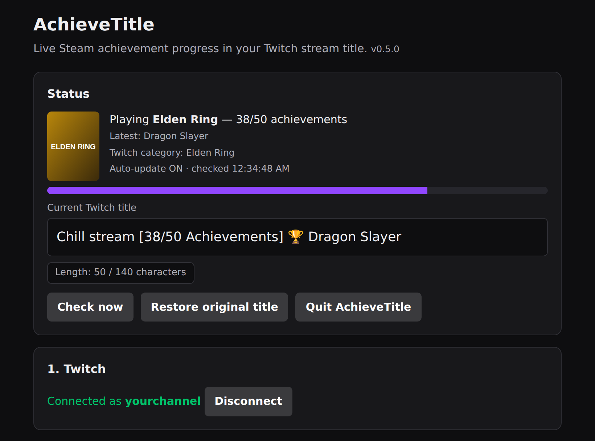
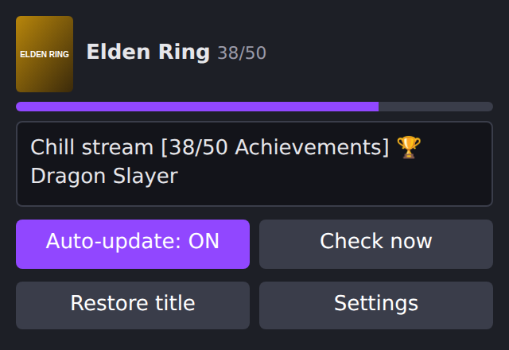

<p align="center">
  
</p>

<p align="center">
  <a href="https://github.com/ImSammyTTV/achievetitle/releases/latest"></a>
  <a href="https://github.com/ImSammyTTV/achievetitle/releases"></a>
  
  <a href="LICENSE"></a>
</p>

<p align="center">
  <b>AchieveTitle</b> keeps your Twitch title in sync with your Steam achievements while you play,<br>
  so viewers always see how far into the game you are.
</p>

<p align="center">
  <a href="https://github.com/ImSammyTTV/achievetitle/releases/latest"><b>⬇️ Download</b></a> ·
  <a href="#-quick-start"><b>🚀 Quick start</b></a> ·
  <a href="#-obs"><b>🎥 OBS</b></a> ·
  <a href="#-mac"><b>🍎 Mac</b></a> ·
  <a href="#-linux"><b>🐧 Linux</b></a> ·
  <a href="#-help"><b>❓ Help</b></a>
</p>

---

## ✨ Features

<table>
<tr>
<td width="50%" valign="top">

### 🏆 Live achievement titles
Your title updates as you unlock achievements, for example
`Chill stream [38/50 Achievements] 🏆 Dragon Slayer`. Nothing is sent to Twitch unless something changed.

</td>
<td width="50%" valign="top">

### 🎮 Automatic category
Switches your Twitch category to the Steam game you're playing, **or pick the game yourself** from a
search with box art. Great for non-Steam games.

</td>
</tr>
<tr>
<td valign="top">

### ✏️ Your title, your way
Templates with placeholders for progress, percentage, latest unlock, rarity and your rarest missing
achievement. Titles are shortened automatically to fit Twitch's 140-character limit.

</td>
<td valign="top">

### 🎥 Built for OBS
A control panel dock inside OBS, an overlay with unlock popups, and an OBS script that updates your title
only while you're live.

</td>
</tr>
<tr>
<td valign="top">

### ↩️ Puts things back
Restores your original title, category and tags when you stop, even after a crash or restart.

</td>
<td valign="top">

### ⬆️ Updates itself
Sits quietly in your system tray / menu bar and installs new versions with one click. Your settings
are always kept.

</td>
</tr>
</table>

<p align="center">
  
</p>

> [!NOTE]
> **Private by design.** AchieveTitle runs entirely on your own computer. Your Steam key and Twitch login
> never leave it, and the settings page only works on your PC (`http://localhost:7878`).

---

## 🚀 Quick start

1. **Download** the file for your system from the [latest release](https://github.com/ImSammyTTV/achievetitle/releases/latest):

   | System | Download |
   |---|---|
   | 🪟 **Windows** | `AchieveTitle-…-windows-amd64.zip` |
   | 🍎 **Mac** | use the [one-line installer](#-mac) (recommended) or `AchieveTitle-…-darwin-arm64.zip` (Apple Silicon) / `darwin-amd64.zip` (Intel) |
   | 🐧 **Linux** | see [Linux](#-linux) below |

2. **Unzip and run AchieveTitle.** The settings page opens in your browser and a 🏆 appears in your tray / menu bar.
3. Click **Connect Twitch**.
4. Paste your **Steam Web API key** ([get one here](https://steamcommunity.com/dev/apikey), use `localhost` as the domain) and your **Steam profile link**.
5. Set your Steam **profile** and **Game details** to *Public*: Steam → Profile → Edit Profile → Privacy Settings.
6. Tick **Update my Twitch title automatically** and click **Save**. Done!

> [!TIP]
> **Windows** may say *"Windows protected your PC"*: click **More info → Run anyway**.
> **Mac:** use the [one-line installer](#-mac) to skip macOS's security prompts entirely.

---

## ✏️ Title templates

Build your title from any text plus these placeholders:

| Placeholder | Shows | Example |
|---|---|---|
| `{custom}` | Your own text | `Chill stream` |
| `{game}` | Game you're playing | `Elden Ring` |
| `{unlocked}` · `{total}` · `{remaining}` | Achievement counts | `38` · `50` · `12` |
| `{percent}` | Completion | `76%` |
| `{latest}` · `{latest_rarity}` | Your latest unlock and how rare it is | `Dragon Slayer` · `4.2%` |
| `{next}` · `{next_rarity}` | Rarest achievement you're still missing | `Speedrunner` · `0.8%` |

**Examples**

```text
{custom} [{unlocked}/{total} Achievements] 🏆 {latest}   →  Chill stream [38/50 Achievements] 🏆 Dragon Slayer
{game} 100% run: {percent} done, {remaining} to go         →  Elden Ring 100% run: 76% done, 12 to go
Hunting {next} ({next_rarity} of players!)                 →  Hunting Speedrunner (0.8% of players!)
```

A **fallback template** is used when you're not in a Steam game or the game has no achievements.

---

## 🎥 OBS



**Control panel dock:** *View → Docks → Custom Browser Docks*, name `AchieveTitle`,
URL `http://localhost:7878/dock`. It shows your game, progress and title, with an on/off switch.

**OBS script:** *Tools → Scripts → +* and choose `obs/achievetitle.lua` (included in every download).
It starts AchieveTitle with OBS and only updates your title while you're live.

**Overlay:** add a *Browser Source* with URL `http://localhost:7878/overlay` (600 × 160) for a progress
bar and an *"Achievement unlocked"* popup.

<br clear="right">

> [!WARNING]
> OBS's own *Stream Information* panel also sets your title. If you press *Update* there, it overwrites
> AchieveTitle's title until the next change.

---

## 🍎 Mac

Open **Terminal** (press ⌘ Space, type *Terminal*, press Enter), paste this and press Enter:

```sh
curl -fsSL https://raw.githubusercontent.com/ImSammyTTV/achievetitle/main/install-mac.sh | sh
```

It picks the right version for your Mac, checks the download against the release's checksum, installs
**AchieveTitle.app** into Applications and opens it. There are no *"can't be opened"* warnings, because Terminal downloads
aren't quarantined the way browser downloads are.

<details>
<summary>Installing from the zip instead</summary>

AchieveTitle isn't signed by Apple yet, so macOS blocks it the first time:

1. Unzip, move **AchieveTitle.app** to Applications and double-click it. macOS says it can't be opened: click **Done**.
2. Open **System Settings → Privacy & Security**, scroll down and click **Open Anyway** next to AchieveTitle.
3. Confirm with your password. From then on it opens normally.
</details>

Uninstall: `curl -fsSL …/install-mac.sh | sh -s -- --uninstall` (your settings are kept).

---

## 🐧 Linux

Works on every distro, including **Steam Deck**. The quickest way (no admin password needed):

```sh
curl -fsSL https://raw.githubusercontent.com/ImSammyTTV/achievetitle/main/install.sh | sh
```

Or install a package from the [latest release](https://github.com/ImSammyTTV/achievetitle/releases/latest):

| Distro | Package |
|---|---|
| Ubuntu, Debian, Mint, Pop!_OS | `.deb` |
| Fedora, openSUSE, Nobara | `.rpm` |
| Arch, Manjaro, EndeavourOS, CachyOS | `.pkg.tar.zst` |
| Alpine | `.apk` |

Start at login (optional): `systemctl --user enable --now achievetitle`.
Uninstall the script version with `curl -fsSL …/install.sh | sh -s -- --uninstall`.

---

## ❓ Help

<details>
<summary><b>It says "Not in a Steam game" but I'm playing</b></summary>

Your Steam profile **and** *Game details* must be **Public** (Steam → Profile → Edit Profile → Privacy Settings).
Steam can take a minute to report a game you just started. Click **Check now** to try again.
</details>

<details>
<summary><b>My category didn't change</b></summary>

AchieveTitle only switches category when it finds a Twitch category with the same name as your Steam game,
so it never puts you in the wrong one. Choose **Let me choose the game** under *Title* to pick it yourself.
</details>

<details>
<summary><b>"Twitch login expired"</b></summary>

Twitch logins last about 60 days. Click **Connect Twitch** again in the settings page.
</details>

<details>
<summary><b>How do I update?</b></summary>

AchieveTitle tells you when a new version is out: click **Update now** in the settings page. Linux package
installs (.deb, .rpm, Arch) update through your package manager as usual.
</details>

<details>
<summary><b>Where are my settings and logs?</b></summary>

| System | Folder |
|---|---|
| Windows | `%AppData%\AchieveTitle` |
| Mac | `~/Library/Application Support/AchieveTitle` |
| Linux | `~/.config/AchieveTitle` |

`config.json` holds your settings and `achievetitle.log` the log. Updating or reinstalling never removes them.
</details>

Still stuck? [Open an issue](https://github.com/ImSammyTTV/achievetitle/issues) and include your `achievetitle.log`.

---

## 🛠️ For developers

<details>
<summary><b>Building from source</b></summary>

Requires Go 1.22+.

```sh
go build .
AchieveTitle -port 7878 -no-browser -no-tray   # all options are optional
```

Builds use the official AchieveTitle Twitch app. To use your own, create a *Public* Twitch app at
<https://dev.twitch.tv/console> with OAuth redirect URL `http://localhost:7878/auth/callback`, then build with
`-ldflags "-X main.DefaultTwitchClientID=YOUR_CLIENT_ID"` or paste the ID into the settings page.
</details>

<details>
<summary><b>Releasing (maintainers)</b></summary>

1. Add a `## vX.Y.Z` section to [`CHANGELOG.md`](CHANGELOG.md): it becomes the release notes.
2. Go to **Actions → Release → Run workflow** and enter the version (e.g. `v0.6.0`, or `v0.6.0-beta.1` for a pre-release).

GitHub Actions builds every download (Windows, macOS, Linux zips and packages) and publishes the release.
AUR and Flatpak packaging files are in [`packaging/`](packaging).
</details>

---

## 🔏 Code signing policy

Windows releases will be signed once the project's application to SignPath Foundation is approved.
When they are:

- Free code signing is provided by [SignPath.io](https://about.signpath.io), with the certificate by [SignPath Foundation](https://signpath.org).
- Only builds made by this repository's [GitHub Actions release workflow](.github/workflows/release.yml) from its public source code are signed.
- **Committers and reviewers:** [ImSammyTTV](https://github.com/ImSammyTTV)
- **Approver:** [ImSammyTTV](https://github.com/ImSammyTTV). Every signing request is approved manually.

## 🔒 Privacy

AchieveTitle has no servers of its own and collects no data. It only talks to:

- **Steam** (`api.steampowered.com`), to read your current game and achievements
- **Twitch** (`id.twitch.tv`, `api.twitch.tv`, `eventsub.wss.twitch.tv`), to log in, update your stream info and, if you turn on chat commands, read and reply in your chat
- **GitHub** (`api.github.com`, `github.com`), to check for and download new versions of AchieveTitle (can be switched off in settings)

Your Steam key and Twitch logins are stored only on your own computer.

---

<p align="center">
  Made with 💜 for streamers · <a href="LICENSE">MIT License</a> · <a href="CHANGELOG.md">Changelog</a>
</p>
